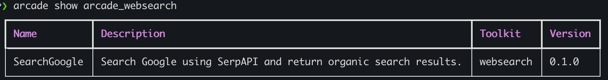

[](https://img.shields.io/github/v/release/arcadeai/arcade-ai)
[](https://github.com/ArcadeAI/Engine/actions/workflows/build.yml)
[](https://codecov.io/gh/arcadeai/arcade-ai)
[](https://img.shields.io/github/commit-activity/m/arcadeai/arcade-ai)
[](https://img.shields.io/github/license/arcadeai/arcade-ai)


# Arcade AI

Arcade AI is the developer platform for building tools designed to be used with language models. With Arcade, developers can create, deploy, and easily integrate new tools with language models to enhance their capabilities.

## `arcade-ai`

<!-- Fix these directories -->

The `arcade-ai` package contains:
 - `arcade.arcade.actor` Serving tools with FastAPI, Flask, or Django
 - `arcade.arcade.sdk` Tool SDK
 - `arcade.arcade.cli` CLI
 - `arcade.arcade.core` Arcade Core Library
 - `arcade.docs` Client Documentation
 - `arcade.tests` Client Tests
 - `assets` Documentation Assets
 - `examples` Actor examples with FastAPI and Flask
 - `schemas` ToolRequest Schemas
 - `toolkits` Toolkits

## Installation

To install the Arcade AI package, execute the following command:

```bash
pip install arcade-ai
```

or install from source:

<!-- Add somewhere that we have arcade-ai/arcade/arcade as a directory which is really strange -->

```bash
git clone https://github.com/arcadeai/arcade-ai.git
cd arcade-ai/arcade
pip install poetry
poetry install
```

## First steps

Follow these steps if you've cloned the repo and installed the package from source:

```bash
cd ../toolkits/websearch
poetry install

arcade show
```
This will show an output that looks like



Export your OPENAI API key to the `OPENAI_API_KEY` environment variable and Serp API key to `SERP_API_KEY`.
```bash
export OPENAI_API_KEY="sk-..."
export SERP_API_KEY="..."
```

Predict the parameters with a model and run the tool with the predicted parameters. Arcade adds the `execute` choice to the tool, which allows you to run the tool with the predicted parameters in a single request.

```bash
> arcade run -t arcade_websearch "who is Sam Partee?" --choice "execute"
Running tool: SearchGoogle with params: {'query': 'Sam Partee'}

[{"position": 1, "title": "Sam Partee (@SamPartee) / X", "link": "https://twitter.com/sampartee", "redirect_link":
"https://www.google.com/url?sa=t&source=web&rct=j&opi=89978449&url=https://twitter.com/sampartee&ved=2ahUKEwjBwKiz3b6HAxV1VTABHXL8BZQQFnoECAYQAQ",
"displayed_link": "1.5K+ followers", "thumbnail":
.....
.. (truncated)
```

Arcade also adds the `generate` choice to the tool, which allows you to interpret the results with a model.

```bash
> arcade run -t arcade_websearch "who is Sam Partee?" --choice "generate" # also the default
Running tool: SearchGoogle with params: {'query': 'Sam Partee'}

Sam Partee is associated with Arcade AI and has a professional profile on LinkedIn. He is based in San Francisco, California, and has over 500 connections. He attended Haverford College. For more detailed
information about his professional background, you can view his LinkedIn profile.
```
